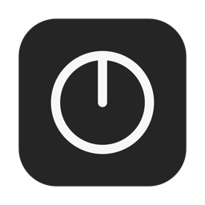
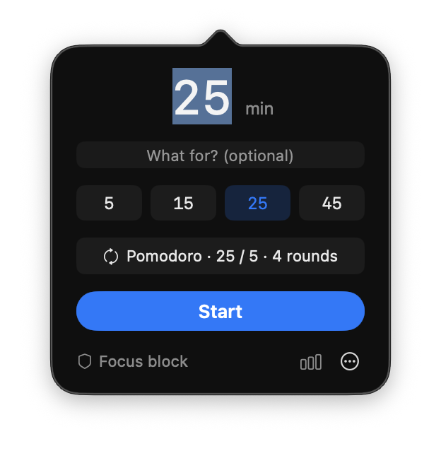
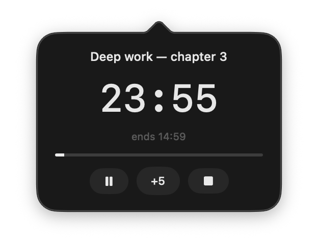
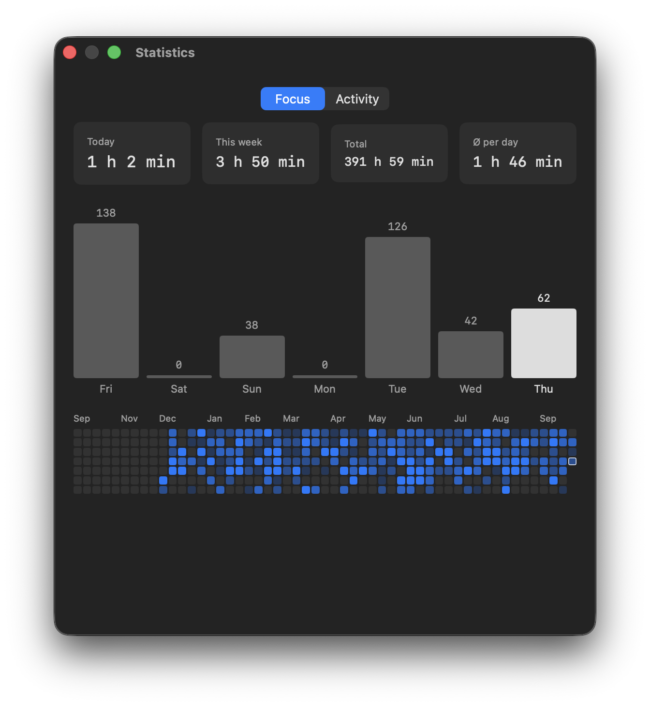
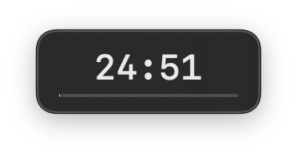
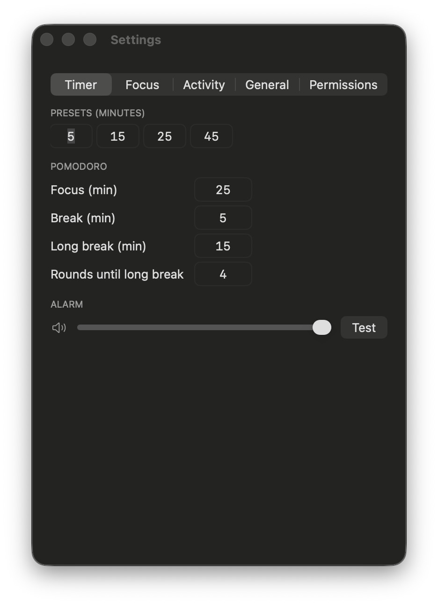

<p align="center">
  
</p>

<h1 align="center">Timer</h1>

<p align="center">
  <strong>A calm menu bar timer for macOS — with pomodoro, a focus block that actually works in fullscreen, and statistics that never leave your Mac.</strong>
</p>

<p align="center">
  <a href="https://github.com/moritzthln/Timer/releases/latest"></a>
  
  
  <a href="https://github.com/moritzthln/Timer/actions/workflows/ci.yml"></a>
  <a href="LICENSE"></a>
</p>

<p align="center">
  
  &nbsp;&nbsp;
  
</p>

---

Click the icon in the menu bar, type a number, press <kbd>Return</kbd>. That is the whole interface for most days. Everything else — pomodoro cycles, blocking distractions, a year of focus history — stays out of the way until you want it.

No account. No subscription. No network access at all: every number Timer shows is computed from files on your own Mac.

## Contents

- [Features](#features)
- [Install](#install) · [Updating](#updating)
- [Permissions](#permissions)
- [Using Timer](#using-timer)
- [Privacy](#privacy)
- [Building from source](#building-from-source)
- [Limitations](#limitations)
- [License](#license)

## Features

| | |
|---|---|
| **Menu bar first** | No Dock icon, no main window. The menu bar shows the remaining time — or, if you prefer, a compact `25m` or just an icon. |
| **One-keystroke start** | <kbd>⌃⌥T</kbd> opens the popover from anywhere, <kbd>⌃⌥S</kbd> starts your last duration without opening anything. |
| **Pomodoro** | Focus, short break, long break — configurable, cycles on its own, survives sleep and restarts. |
| **A dedication per session** | One optional line — *"what is this time for?"* — shown above the countdown. |
| **Focus block** | Hide distracting apps and switch away from distracting websites while a session runs. Takes apps out of fullscreen first, so nothing escapes into its own Space. Nothing is ever quit. |
| **Emergency mode** | Lock the Mac down to a short list for 1–60 minutes, independent of any timer. Cancelling takes a deliberate ten-second hold. |
| **Statistics** | Focus time today, this week and in total, a seven-day chart and a twelve-month heatmap. |
| **Activity** | A private timeline of which apps and websites you used and when — with a filter for *only the time inside focus sessions*. |
| **English & German** | Follows your system language; switchable in Settings. |

<p align="center">
  
</p>

## Install

1. **Download** `Timer.zip` from the [latest release](https://github.com/moritzthln/Timer/releases/latest) and unzip it.
2. **Move** `Timer.app` into your *Applications* folder.
3. **Open it the first time with a right-click → Open**, then confirm with *Open* once more.

> [!IMPORTANT]
> Timer is not distributed through the App Store and is not notarized by Apple, so macOS asks once before the first launch. After that, a normal double-click works.
>
> If macOS reports that the app *"is damaged and can't be opened"*, remove the download quarantine once in Terminal:
>
> ```bash
> xattr -dr com.apple.quarantine /Applications/Timer.app
> ```

Timer then appears in the menu bar at the top right of your screen.

To start it with your Mac, turn on **Settings → General → Start at login**.

### Updating

Download the newest `Timer.zip` from [Releases](https://github.com/moritzthln/Timer/releases/latest), quit Timer, and replace the app in your *Applications* folder. Your settings and history stay where they are.

Timer never checks for updates on its own — that would mean a network request, and it makes none. To hear about new versions, click **Watch → Custom → Releases** at the top of this page and GitHub will notify you.

## Permissions

Timer works without any special permission. Two features need one — and the **Permissions** tab in Settings shows the live state of each, with a button to check it and a link straight to the right place in System Settings.

| Permission | Used for | Without it |
|---|---|---|
| **Accessibility** | Taking blocked apps out of fullscreen and hiding them | Apps in fullscreen are not blocked |
| **Automation** (per browser: Safari, Chrome, Arc) | Reading the address of the front tab — for the website block and the website statistics | Websites are neither blocked nor listed |
| **Shortcuts** *(optional)* | Turning macOS *Do Not Disturb* on and off with your sessions | Sessions do not touch Focus modes |

> [!NOTE]
> macOS ties these permissions to the exact build of an app. After installing a new version, you may have to grant **Accessibility** again: in *System Settings → Privacy & Security → Accessibility*, remove the old *Timer* entry with **−** and add the new one with **+**. Timer warns you when a block starts without it.

## Using Timer

### Timers and pomodoro

- Type minutes and press <kbd>Return</kbd>, click one of the four presets, or click **Pomodoro** for a full cycle.
- While a session runs you can pause, add five minutes with **+5**, skip a pomodoro phase, or stop.
- An optional floating display keeps the countdown on top of every window and Space.

<p align="center">
  
</p>

### The focus block

Turn it on with the shield at the bottom left of the popover, then choose a mode next to it:

- **Block** hides the apps and websites you marked.
- **Allowed only** hides everything *except* what you marked. Allowing a website keeps your browsers reachable, but only for those sites.

The block is **gentle by design**: apps are hidden, never quit, and come back the moment the session ends. Blocked websites stay open — the browser simply switches to another tab. Timer, Finder and System Settings are always reachable, so you can never lock yourself out.

**How it handles fullscreen.** macOS lets an app keep its own fullscreen Space even after it was hidden, and it only reveals the windows of the app that is currently active. So Timer first visits every app that fills a screen — one after another, following browsers with several profile windows across Spaces — takes each out of fullscreen, and only then hides them. You will see your Spaces flick through for a moment when a session starts.

### Emergency mode

From the popover's **⋯** menu (or its own hotkey): everything except a list you chose beforehand is hidden for 1 to 60 minutes — whether a timer runs or not. The lists freeze while it runs, and the only way out early is to hold a button for ten seconds. That friction is the point.

### Statistics and activity

The chart button in the popover opens the statistics window:

- **Focus** — time in focus sessions today, this week, in total and on an average active day, plus a seven-day chart and a twelve-month heatmap.
- **Activity** — a zoomable timeline of your day or week: which apps you used, which websites, when you were away. Select a row to highlight it on the timeline; tick **Focus time only** to see what actually happened during your sessions.

### Settings at a glance

<p align="center">
  
</p>

Five tabs: **Timer** (presets, pomodoro, alarm), **Focus** (block lists, emergency mode, Do Not Disturb), **Activity** (tracking, websites listed separately), **General** (language, login, menu bar format, hotkeys) and **Permissions**.

## Privacy

Timer makes **no network requests** — there is no server, no telemetry, no update check.

Everything it records stays on your Mac:

| What | Where |
|---|---|
| Settings and focus totals | `~/Library/Preferences/com.moritzthelen.timer.plist` |
| Activity timeline (apps, website domains, presence) | `~/Library/Application Support/Timer/activity/` — one JSON file per day |
| Focus session intervals | `~/Library/Application Support/Timer/focus/` |

Website tracking stores domains only, never full addresses, page titles or content. Window titles are never read. Activity tracking can be paused at any time in **Settings → Activity**; deleting the folders above erases the history.

## Building from source

Requirements: macOS 13 or newer and Swift 5.9+ (Xcode or the Command Line Tools — `xcode-select --install` is enough).

```bash
git clone https://github.com/moritzthln/Timer.git
cd Timer
./build.sh
```

`build.sh` builds a release binary, assembles `Timer.app`, signs it and installs it to `/Applications`. Other commands:

| Command | What it does |
|---|---|
| `swift build` | Debug build |
| `swift run TimerAppTestRunner` | Runs the test suite (a small custom runner, so it works without Xcode) |
| `./package.sh` | Builds a universal (Apple Silicon + Intel) `Timer.zip` into `share/` |

### Project layout

```
Sources/
  TimerCore/   Pure, unit-tested logic: the timer engine, pomodoro sequencing,
               block rules, statistics and activity storage
  TimerApp/    The macOS app: menu bar, popover, windows, SwiftUI views,
               and everything that talks to other apps
Tests/
  TimerAppTestRunner/   The test suite
Resources/     Info.plist, app icon, bundled alarm sounds
```

The rule of thumb: anything that can be decided without AppKit lives in `TimerCore` and has tests; `TimerApp` only gathers state from the system and acts on the decision.

Contributions are welcome — see [CONTRIBUTING.md](CONTRIBUTING.md). Changes per version are listed in the [CHANGELOG](CHANGELOG.md).

## Limitations

- **Blocking is a nudge, not a lock.** Quitting Timer ends any block and restores every hidden app. That is deliberate: a focus tool should never hold your Mac hostage.
- **Fullscreen is not restored.** Apps the block took out of fullscreen come back as normal windows.
- **Websites:** blocking and website statistics cover Safari, Chrome and Arc, and only the active tab of a browser's front window.
- **Not notarized.** Without a paid Apple Developer ID, macOS shows the first-launch prompt described above and forgets granted permissions after updates.

## License

[MIT](LICENSE) © 2026 Moritz Thelen
